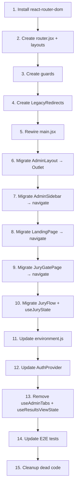

# VERA URL Routing — React Router v6 Migration

Mevcut custom in-memory routing sistemini (`page` state + query params + `pushState`) tamamen React Router v6'ya geçiriyoruz. Tüm navigasyon path-based olacak, demo mode `/demo/*` prefix ile ayrılacak, jury flow step'leri URL'de görünecek.

## User Review Required

> [!IMPORTANT]
> **ExportPage kaldırılıyor**: Sidebar'da zaten butonu yok, `admin/export` tab'ı router'a eklenmeyecek. `ExportPage.jsx` dosyası şimdilik silinmeyecek ama route tanımlanmayacak.

> [!IMPORTANT]
> **Google OAuth redirect URL**: `?admin` → `/login` olarak değiştiğinden, Supabase Dashboard'ta redirect URL güncellenmeli. Bu değişikliği sen yapacaksın.

> [!WARNING]
> **Landing butonları SPA'ya çevriliyor**: `window.location.href` (full page reload) yerine `useNavigate()` kullanılacak. SessionStorage/environment logic'i SPA navigasyonu ile uyumlu hale getirilecek.

---

## Proposed Changes

### 1. Dependency Installation

#### [MODIFY] [package.json](file:///Users/huguryildiz/Documents/GitHub/VERA/package.json)

- `react-router-dom@^6.28.0` eklenmesi

---

### 2. Router Infrastructure (Yeni Dosyalar)

#### [NEW] [router.jsx](file:///Users/huguryildiz/Documents/GitHub/VERA/src/router.jsx)

Central route tanımları. `createBrowserRouter` ile:

```text
/                         → LandingPage
/login                    → LoginScreen
/register                 → RegisterScreen
/forgot-password          → ForgotPasswordScreen
/reset-password           → ResetPasswordScreen

/eval                     → JuryGatePage (?t=TOKEN, ?env=demo)
/jury                     → JuryFlow (redirect to /jury/identity)
/jury/identity            → IdentityStep
/jury/period              → SemesterStep
/jury/pin                 → PinStep
/jury/pin-reveal          → PinRevealStep
/jury/locked              → LockedStep
/jury/progress            → ProgressStep
/jury/evaluate            → EvalStep
/jury/complete            → DoneStep

/admin                    → AdminLayout (redirect to /admin/overview)
/admin/overview           → OverviewPage
/admin/rankings           → RankingsPage
/admin/analytics          → AnalyticsPage
/admin/heatmap            → HeatmapPage
/admin/reviews            → ReviewsPage
/admin/jurors             → JurorsPage
/admin/projects           → ProjectsPage
/admin/periods            → PeriodsPage
/admin/criteria           → CriteriaPage
/admin/outcomes           → OutcomesPage
/admin/entry-control      → EntryControlPage
/admin/pin-blocking       → PinBlockingPage
/admin/audit-log          → AuditLogPage
/admin/settings           → SettingsPage

/demo                     → DemoAdminLoader → /demo/admin
/demo/admin               → AdminLayout (demo mode)
/demo/admin/*             → mirrors /admin/* structure
```

#### [NEW] [layouts/RootLayout.jsx](file:///Users/huguryildiz/Documents/GitHub/VERA/src/layouts/RootLayout.jsx)

- `ThemeProvider` + `AuthProvider` + `ToastContainer` wrapper
- `<Outlet />` ile child route rendering
- ErrorBoundary

#### [NEW] [layouts/AdminRouteLayout.jsx](file:///Users/huguryildiz/Documents/GitHub/VERA/src/layouts/AdminRouteLayout.jsx)

- Mevcut `AdminLayout.jsx`'teki auth gate + sidebar + header mantığı korunur
- `useAdminTabs` kaldırılır → `useLocation` + `useNavigate` kullanılır
- `adminTab` yerine `location.pathname` parse edilir
- `<Outlet />` ile child page rendering

#### [NEW] [layouts/DemoLayout.jsx](file:///Users/huguryildiz/Documents/GitHub/VERA/src/layouts/DemoLayout.jsx)

- `/demo/*` route'lar altında otomatik olarak `setEnvironment("demo")` çağırır
- `<Outlet />` ile child rendering

#### [NEW] [guards/AuthGuard.jsx](file:///Users/huguryildiz/Documents/GitHub/VERA/src/guards/AuthGuard.jsx)

- Auth gerektiren route'ları korur (`/admin/*`)
- `useAuth()` ile kontrol → login yoksa `/login`'e redirect

#### [NEW] [guards/JuryGuard.jsx](file:///Users/huguryildiz/Documents/GitHub/VERA/src/guards/JuryGuard.jsx)

- Jury session gerektiren route'ları korur (`/jury/*`)
- `getJuryAccess()` yoksa `/eval`'e redirect

#### [NEW] [hooks/useAdminNav.js](file:///Users/huguryildiz/Documents/GitHub/VERA/src/admin/hooks/useAdminNav.js)

- `useAdminTabs`'ın yerine geçer
- `useLocation()` + `useNavigate()` tabanlı
- Dirty form guard korunur (çıkış confirm dialog)
- `scoresView` mantığı kaldırılır → her view kendi path'ine sahip

#### [NEW] [LegacyRedirects.jsx](file:///Users/huguryildiz/Documents/GitHub/VERA/src/LegacyRedirects.jsx)

Eski URL'lerden yenilerine redirect map:

- `/?admin` → `/login`
- `/?explore` → `/demo`
- `/?eval=TOKEN` → `/eval?t=TOKEN`
- `/?t=TOKEN` → `/eval?t=TOKEN`
- `/?tab=overview` → `/admin/overview`
- `/?tab=scores&view=rankings` → `/admin/rankings`
- `/?tab=scores&view=analytics` → `/admin/analytics`
- `/?tab=scores&view=grid` → `/admin/heatmap`
- `/?tab=scores&view=details` → `/admin/reviews`
- `/?tab=jurors` → `/admin/jurors`
- `/?tab=projects` → `/admin/projects`
- `/?tab=periods` → `/admin/periods`
- `/?tab=criteria` → `/admin/criteria`
- `/?tab=outcomes` → `/admin/outcomes`
- `/?tab=entry-control` → `/admin/entry-control`
- `/?tab=pin-lock` → `/admin/pin-blocking`
- `/?tab=audit-log` → `/admin/audit-log`
- `/?tab=settings` → `/admin/settings`
- `/?page=reset-password` → `/reset-password`
- `/?type=recovery` → `/reset-password`
- `/#type=recovery` → `/reset-password`
- `/?env=demo&eval=TOKEN` → `/eval?t=TOKEN&env=demo`
- `/?explore&tab=X` → `/demo/admin/X`
- `/jury-entry` → `/jury`

---

### 3. Mevcut Dosya Değişiklikleri

#### [MODIFY] [main.jsx](file:///Users/huguryildiz/Documents/GitHub/VERA/src/main.jsx)

- `<App />` yerine `<RouterProvider router={router} />`
- `ThemeProvider` + `AuthProvider` → `RootLayout` içine taşınıyor

#### [MODIFY] [App.jsx](file:///Users/huguryildiz/Documents/GitHub/VERA/src/App.jsx)

- `readInitialPage()`, `page` state, tüm conditional rendering **kaldırılır**
- Legacy redirect logic eklenir (ilk yüklemede query params varsa yeni URL'e redirect)
- Geçişten sonra bu dosya minimal kalır veya tamamen `router.jsx` + layout'lara taşınır

#### [MODIFY] [LandingPage.jsx](file:///Users/huguryildiz/Documents/GitHub/VERA/src/landing/LandingPage.jsx)

- `onStartJury`, `onAdmin`, `onSignIn` props **kaldırılır**
- Yerine `useNavigate()` kullanılır:
  - "Experience Demo" → `navigate("/eval?t=TOKEN&env=demo")`
  - "Explore Admin Panel" → `navigate("/demo")`
  - "Sign In" → `navigate("/login")`
- `window.location.href` (full page reload) kullanımı tamamen kaldırılır

#### [MODIFY] [JuryGatePage.jsx](file:///Users/huguryildiz/Documents/GitHub/VERA/src/jury/JuryGatePage.jsx)

- `window.history.replaceState(null, "", "/jury-entry")` → `navigate("/jury/identity", { replace: true })`
- `onGranted` / `onBack` props → `useNavigate()` ile doğrudan navigasyon
- Token `useSearchParams()` ile okunur

#### [MODIFY] [JuryFlow.jsx](file:///Users/huguryildiz/Documents/GitHub/VERA/src/jury/JuryFlow.jsx)

- Step routing URL-sync: `useJuryState.step` değiştiğinde `navigate("/jury/{step}")` çağrılır
- `onBack` prop → `navigate("/")`
- Step→path mapping: `identity`, `period`, `pin`, `pin-reveal`, `locked`, `progress`, `evaluate`, `complete`

#### [MODIFY] [AdminLayout.jsx](file:///Users/huguryildiz/Documents/GitHub/VERA/src/admin/layout/AdminLayout.jsx)

- **Auth gate** (login/register/forgot/reset rendering) → tamamen kaldırılır, artık ayrı route'lar
- `useAdminTabs` → `useLocation()` + `useNavigate()` (yeni `useAdminNav` hook)
- Tab conditional rendering (`{adminTab === "overview" && ...}`) → `<Outlet />` ile değiştirilir
- `onReturnHome` prop → `navigate("/")`
- Scores sub-view mantığı (adminTab === "scores" && scoresView) → her view kendi route'u

#### [MODIFY] [AdminSidebar.jsx](file:///Users/huguryildiz/Documents/GitHub/VERA/src/admin/layout/AdminSidebar.jsx)

- `setAdminTab("overview")` → `navigate("/admin/overview")` (veya `/demo/admin/overview`)
- `switchScoresView("rankings")` → `navigate("/admin/rankings")`
- `isActive()` fonksiyonu → `useLocation().pathname` tabanlı karşılaştırma
- Props: `adminTab`, `scoresView`, `setAdminTab`, `switchScoresView` → **kaldırılır**
- Yerine: `currentPage` + `basePath` props

#### [MODIFY] [AdminHeader.jsx](file:///Users/huguryildiz/Documents/GitHub/VERA/src/admin/layout/AdminHeader.jsx)

- `adminTab` + `scoresView` props → `currentPage` tek prop

#### [MODIFY] [useAdminTabs.js](file:///Users/huguryildiz/Documents/GitHub/VERA/src/admin/hooks/useAdminTabs.js)

- **Kaldırılır** — tüm işlevi `useAdminNav` + React Router tarafından devralınır

#### [MODIFY] [useResultsViewState.js](file:///Users/huguryildiz/Documents/GitHub/VERA/src/admin/hooks/useResultsViewState.js)

- **Kaldırılır** — her scores view kendi route path'ine sahip

#### [MODIFY] [environment.js](file:///Users/huguryildiz/Documents/GitHub/VERA/src/shared/lib/environment.js)

- `?explore` kontrolü kaldırılır
- Yerine: pathname `/demo/` ile başlıyorsa → demo mode
- `resolveEnvironment()`: `window.location.pathname.startsWith("/demo")` kontrolü eklenir

#### [MODIFY] [AuthProvider.jsx](file:///Users/huguryildiz/Documents/GitHub/VERA/src/auth/AuthProvider.jsx)

- Google OAuth redirect: `${window.location.origin}?admin` → `${window.location.origin}/login`
- Sign out: redirect to `/`

---

### 4. E2E Test Güncellemeleri

#### [MODIFY] E2E test files

Tüm e2e testleri şu an `page.goto("/")` ile başlıyor. Doğrudan yeni path'lere güncellenmeli:

- `admin-login.spec.ts`: `page.goto("/login")`
- `admin-export.spec.ts`: `page.goto("/login")` → login → navigate
- `admin-import.spec.ts`: `page.goto("/login")` → login → navigate
- `admin-results.spec.ts`: `page.goto("/login")` → login → navigate
- `jury-flow.spec.ts`: `page.goto("/eval?t=TOKEN")` doğrudan
- `jury-lock.spec.ts`: `page.goto("/eval?t=TOKEN")` doğrudan
- `tenant-isolation.spec.ts`: url pattern'leri güncellenmeli

---

### 5. Config Güncellemeleri

#### [MODIFY] [vercel.json](file:///Users/huguryildiz/Documents/GitHub/VERA/vercel.json)

- Zaten `/(.*) → /index.html` wildcard var → değişiklik gerekmez ✓

#### [MODIFY] [vite.config.js](file:///Users/huguryildiz/Documents/GitHub/VERA/vite.config.js)

- Dev server'da SPA fallback zaten Vite default → değişiklik gerekmez ✓

---

## Migration Strategy (İş Sırası)



> [!TIP]
> Her adımdan sonra `npm run dev` ile uygulamanın çalıştığı doğrulanacak. Migration incremental yapılacak, big-bang değil.

---

## Open Questions

1. **`pin-lock` → `pin-blocking` renaming**: Sidebar'da "PIN Blocking" yazıyor ama URL'de `pin-lock` idi. Yeni URL'de `/admin/pin-blocking` olarak değiştirildi → uygun.

---

## Verification Plan

### Automated Tests

- `npm run dev` → tüm route'ların açıldığını doğrula
- `npm run build` → production build hatasız tamamlanmalı
- E2E testlerinin yeni URL'lerle geçtiğini doğrula
- Browser back/forward navigasyonu doğrula

### Manual Verification

- Her URL pattern'ini tarayıcıda test et:
  - `/` → Landing
  - `/login` → Login form
  - `/eval?t=TOKEN` → Jury Gate
  - `/jury/identity` → Jury flow step
  - `/admin/overview` → Admin dashboard
  - `/demo` → Demo loader → `/demo/admin`
  - `/demo/admin/rankings` → Demo rankings
- Legacy URL redirect'lerini test et (`/?admin`, `/?explore`, `/?eval=TOKEN`)
- Supabase Google OAuth redirect test et (sen güncelledikten sonra)
