# Admin Walkthrough

A tour of the VERA administrator interface from the perspective of a faculty coordinator running a capstone jury day. Screenshots are captured from the TEDU — Electrical-Electronics Engineering Spring 2026 period.

---

## 1. Live Overview

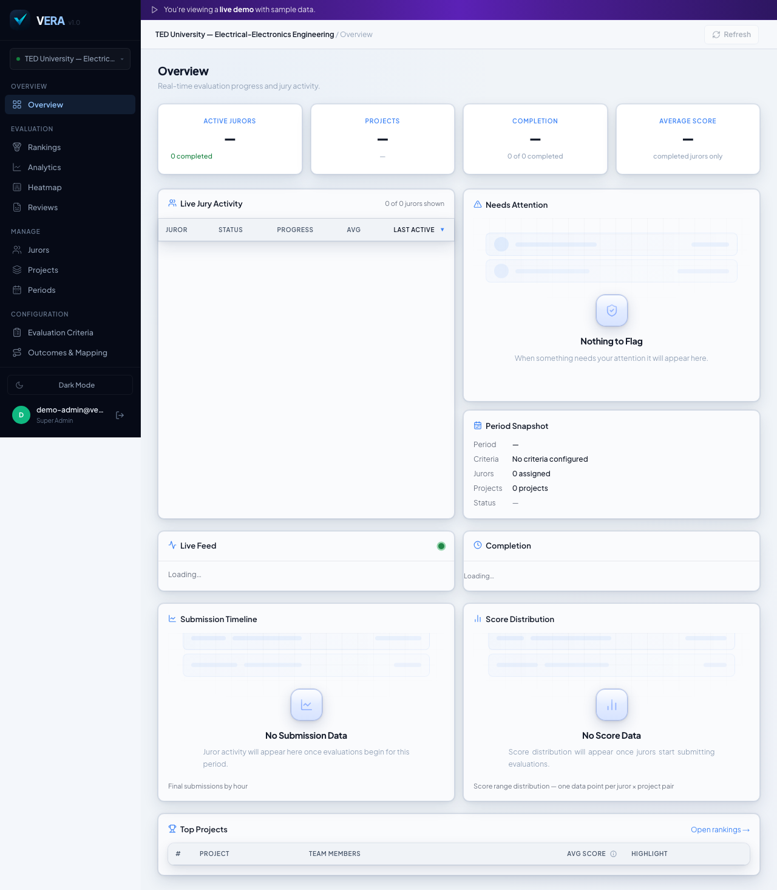

**What this screen shows.** The Overview is the command center for an active jury day. At a glance the admin sees how many jurors are currently scoring, how many projects have been fully evaluated, and which jurors have submitted their final scores. The KPI strip updates in real time as scores arrive.

**What to notice:**

- Active juror count and total project count are prominent above the fold.
- Progress indicators show evaluation completeness across the current period.
- No page refresh required — the dashboard subscribes to live score events via Supabase Realtime.

---

## 2. Setup Wizard

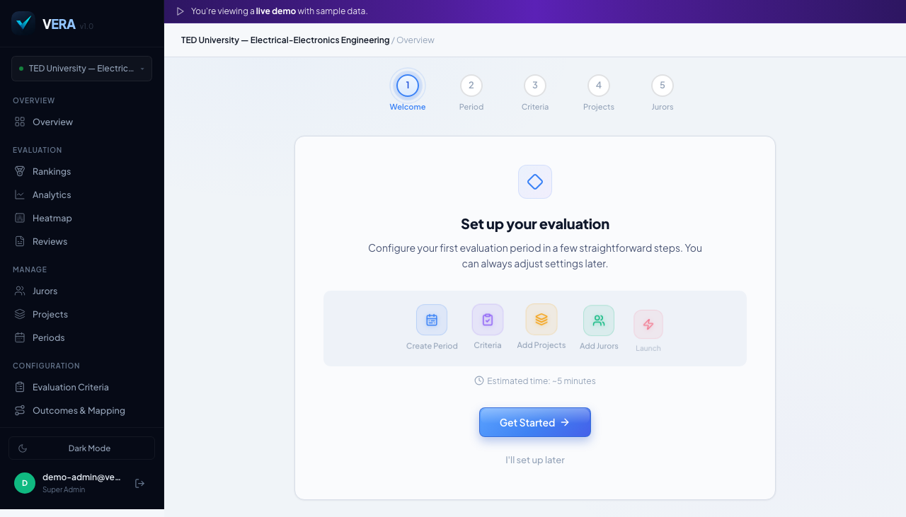

**What this screen shows.** New administrators are guided through a step-by-step wizard the first time they access VERA. The wizard covers organization profile, evaluation period creation, rubric criteria, accreditation outcome mapping, and project import — all in one guided flow before the first jury day.

**What to notice:**

- The stepper at the top shows exactly where the admin is in the onboarding sequence.
- Each step is independently completable; the wizard remembers progress between sessions.
- A typical organization is production-ready in under 10 minutes.

---

## 3. Periods

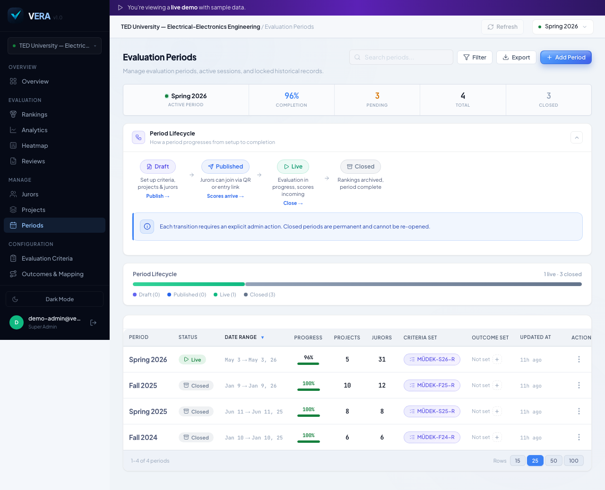

**What this screen shows.** Evaluation periods are the primary unit of organization in VERA. Each period represents one academic term's jury cycle, carries its own rubric snapshot (criteria + outcomes), and is isolated from other periods so year-over-year data never leaks.

**What to notice:**

- Each period row shows its lifecycle state (Draft → Active → Locked → Closed) and the accreditation framework attached to it.
- Periods can be cloned to carry forward last year's rubric with minimal rework.
- A locked period's rubric is permanently frozen — scores are immutable once the period closes.

---

## 4. Period Actions

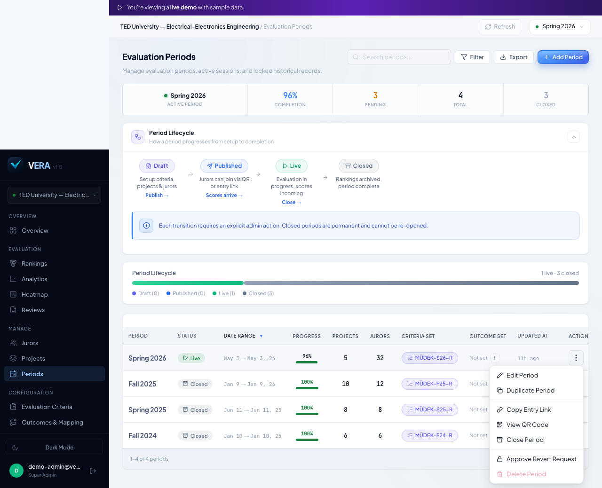

**What this screen shows.** Each period row exposes a full set of lifecycle actions through the actions menu. From here the admin can edit period details, activate the period for juror access, lock it when scoring is complete, export its data, or clone it for the next term.

**What to notice:**

- Edit and Activate are available on Draft periods; Lock becomes available once a period is Active.
- Clone copies the rubric structure (criteria, outcomes, bands) without copying any scores.
- All state transitions are recorded in the Audit Log (screen 13).

---

## 5. Criteria

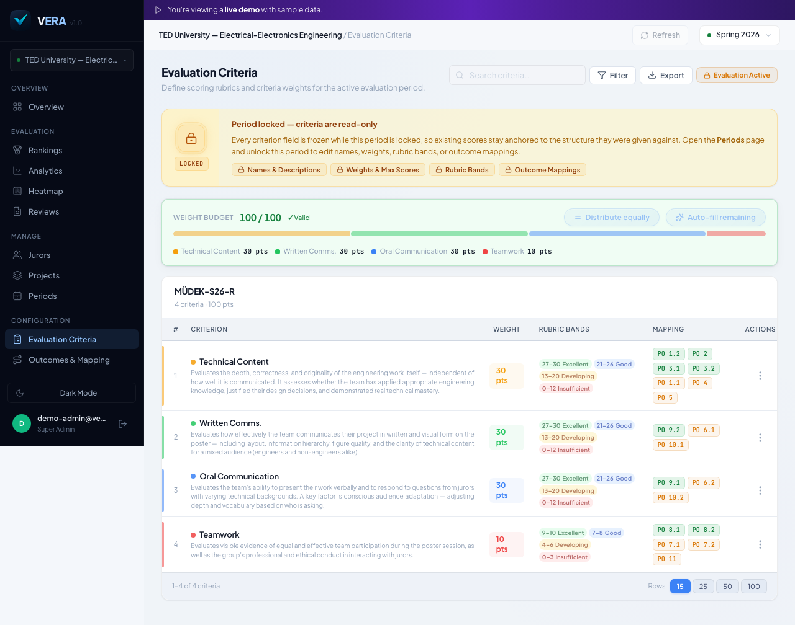

**What this screen shows.** The Criteria page is where the admin builds the scoring rubric. Each criterion has a name, a weight (must sum to 100%), and a set of performance bands — the ranges jurors select from when scoring (e.g., Unsatisfactory 0–40, Developing 41–60, Proficient 61–80, Exemplary 81–100).

**What to notice:**

- Weight validation fires in real time — the Save button stays disabled until weights total exactly 100%.
- Band ranges are visually validated for gaps and overlaps.
- Once a period is activated, criteria are snapshotted and become read-only, ensuring all jurors score against the same rubric.

---

## 6. Outcomes

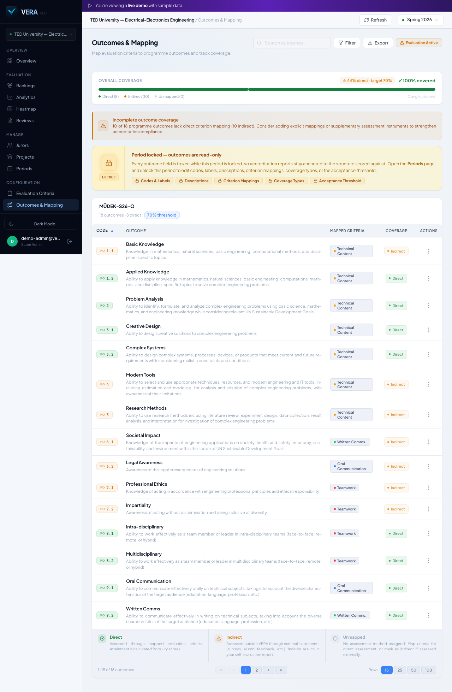

**What this screen shows.** The Outcomes page maps each criterion to one or more accreditation outcomes (ABET Student Outcomes, MÜDEK program criteria, or custom institutional outcomes). Each mapping is tagged as Direct or Indirect, and VERA uses the full mapping table to calculate outcome attainment percentages for the accreditation report.

**What to notice:**

- Outcomes are color-coded by attainment level in reports (met / partially met / not met).
- The same rubric can be mapped to multiple frameworks simultaneously.
- Unmapped criteria generate a warning — the admin must explicitly confirm that an unmapped criterion is intentional.

---

## 7. Projects

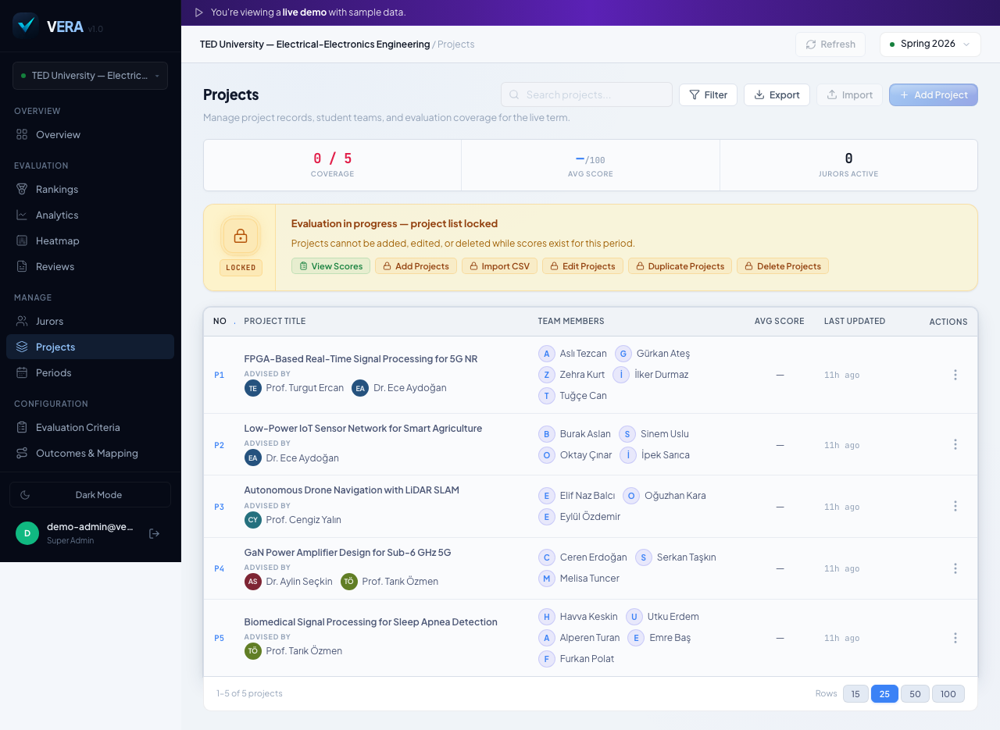

**What this screen shows.** The Projects page lists all capstone projects registered for the current evaluation period. Each project entry carries the project title, team members, and advisor name — the same data that jurors see when they open a scoring sheet.

**What to notice:**

- Projects can be imported in bulk via CSV upload or added individually.
- The project list is period-scoped; projects from previous terms are not shown unless explicitly browsed.
- Project data is locked alongside the rubric when the period transitions to Active.

---

## 8. Jurors

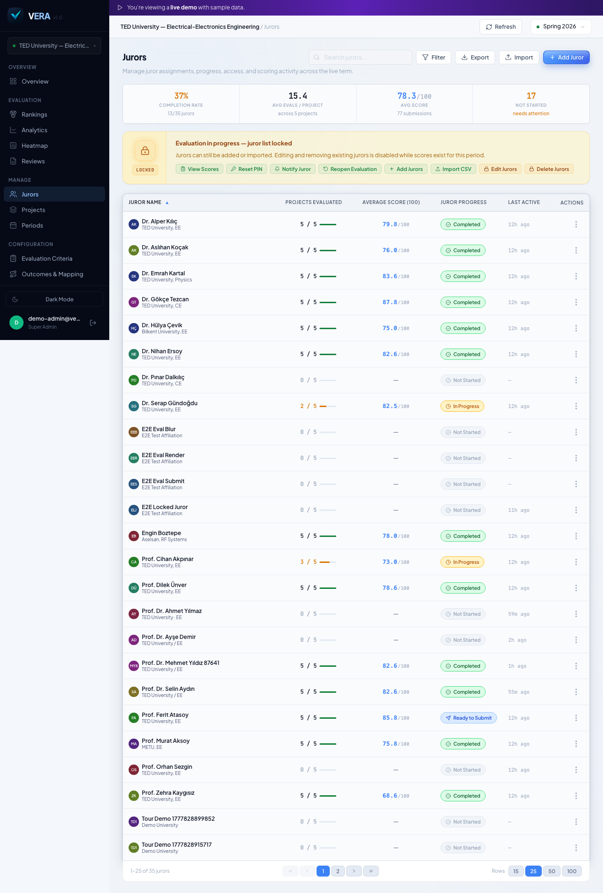

**What this screen shows.** The Jurors page is the roster of all evaluators registered for the current period. Each juror has a name, affiliation (institution and department), and an account status. The admin can add jurors individually, see who has signed in, and track which jurors have submitted final scores.

**What to notice:**

- Jurors do not need an email account — they authenticate with a single-use entry token and a self-chosen PIN.
- The roster shows real-time status: not started, in progress, or submitted.
- Jurors can be created and distributed tokens in the same workflow (see Entry Control, screen 9).

---

## 9. Entry Control

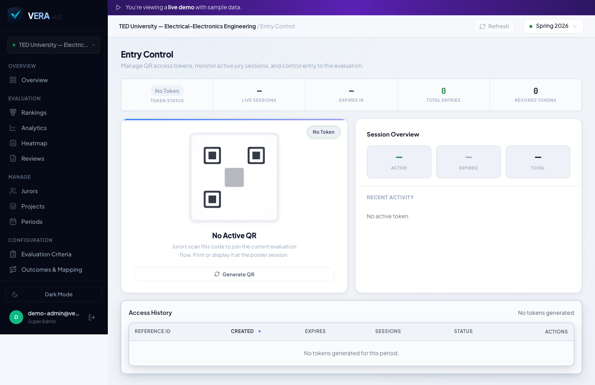

**What this screen shows.** Entry tokens are the single-use links used to admit jurors to the evaluation flow without requiring institutional email accounts. The admin generates a batch of tokens, distributes them (email, PDF, print), and can revoke any token at any time up until its 24-hour expiry.

**What to notice:**

- Each token is a short URL-safe string that auto-fills the evaluation gate — jurors do not need to copy or type it.
- Revoked tokens immediately deny entry; the juror sees a clear "token revoked" message rather than a generic error.
- Token generation and revocation events are written to the Audit Log (screen 13).

---

## 10. Heatmap

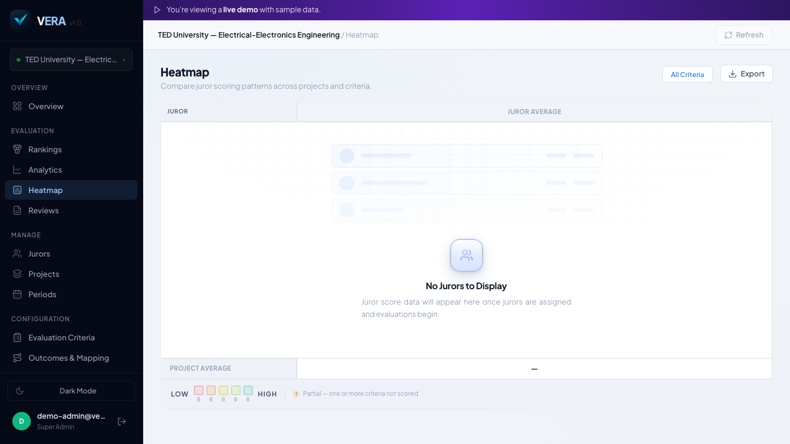

**What this screen shows.** The Heatmap is the most visually immediate view of a live jury day. Every cell is a (juror, project) pair, colored by average score. Blank cells show who has not yet scored which project; warm cells flag outliers worth reviewing before scores are finalized.

**What to notice:**

- The overall average score is displayed prominently and updates as each juror submits.
- The heatmap is read-only for admins — it observes, not edits.
- Color bands follow the same rubric band definitions configured in Criteria (screen 5).

---

## 11. Rankings

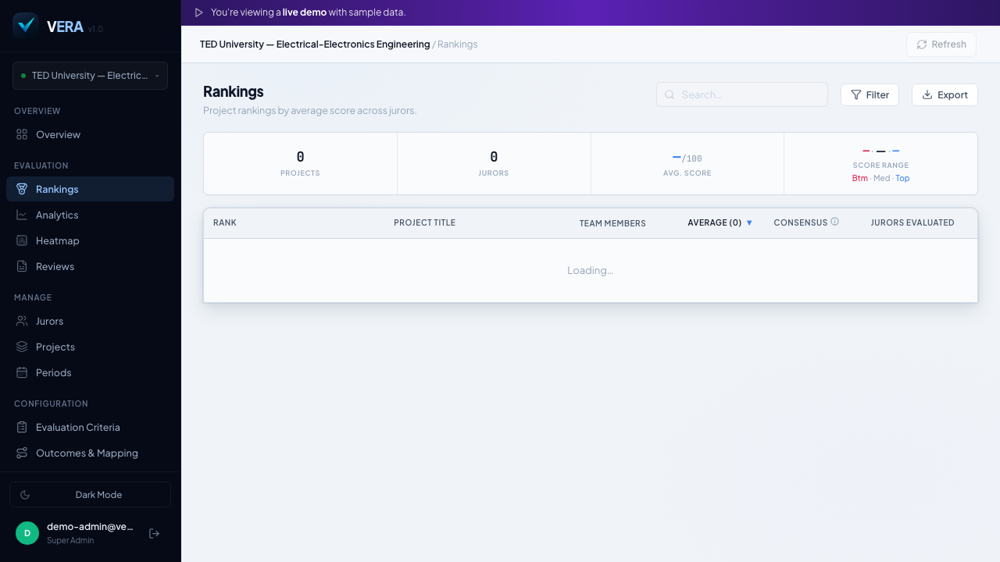

**What this screen shows.** After scoring is complete, the Rankings page shows every project's weighted average score, rank, and comparison to the period average. Tie-breaking follows a deterministic algorithm so rankings are reproducible regardless of when the page is loaded.

**What to notice:**

- Rankings can be filtered by advisor, team size, or score range.
- The Export button opens the export panel (screen 14) pre-configured for the current view.
- Rankings are computed server-side — no client-side aggregation that could diverge between browser sessions.

---

## 12. Analytics — Outcome Attainment

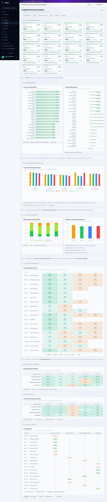

**What this screen shows.** The Analytics page translates raw scores into accreditation-ready outcome attainment rates. For each program outcome, VERA calculates the percentage of projects that met the attainment threshold and renders a visual breakdown by attainment tier.

**What to notice:**

- Attainment thresholds (e.g., 60% of students must score ≥ 60% on a criterion for the outcome to be "met") are configurable per period.
- The chart switches between MÜDEK, ABET, and custom outcome sets based on the framework attached to the period.
- A per-outcome card below the chart shows exact numerics for inclusion in the accreditation self-study report.

---

## 13. Audit Log

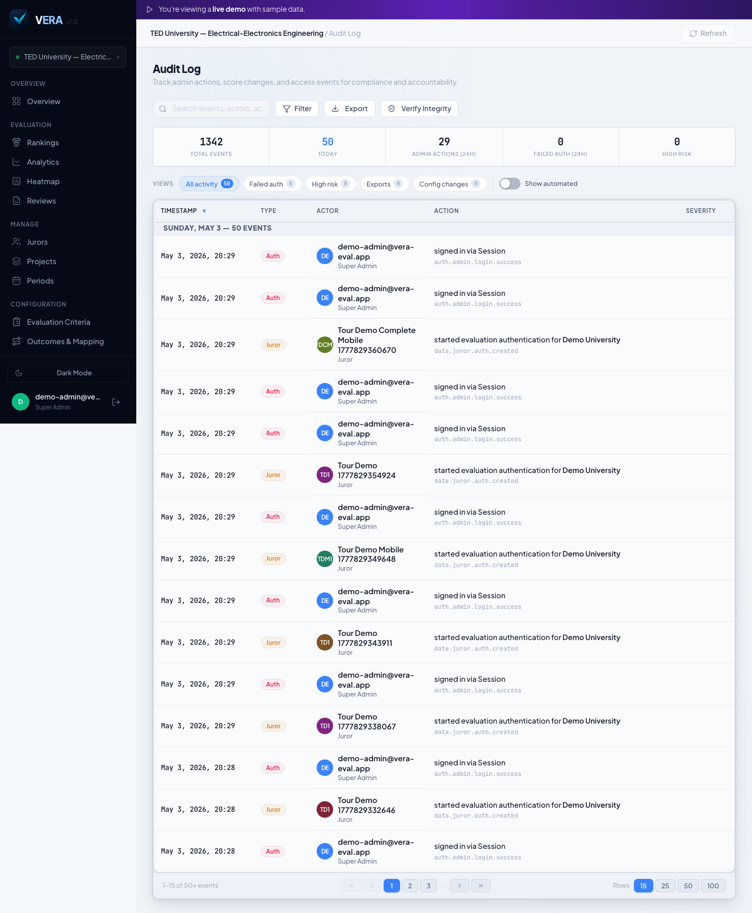

**What this screen shows.** Every significant action in VERA — criteria changes, period state transitions, token issuances and revocations, score submissions, and admin settings edits — is recorded in an append-only, hash-chained audit log. The log is the compliance trail required by accreditation bodies that mandate process documentation.

**What to notice:**

- The KPI strip shows event counts by category over the current period.
- Each row carries a timestamp, actor identity, action type, and a structured diff of what changed.
- The hash chain makes retroactive tampering detectable — any deleted or modified row breaks the chain.

---

## 14. Export

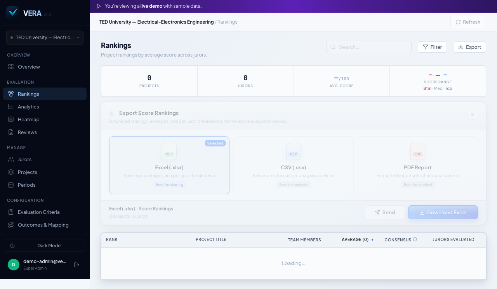

**What this screen shows.** The Export panel generates an XLSX file from the current view. Column selection, score precision, and active filters are all respected in the export — what the admin sees on screen is exactly what lands in the spreadsheet.

**What to notice:**

- XLSX output uses numeric cell types (not text-formatted numbers) so downstream pivot tables and formulas work without cleanup.
- Turkish characters (ç ğ ı ö ş ü) are preserved correctly in all column headers and values.
- The export is scoped to the active period — no cross-period data leaks into the file.

---

*Screenshots captured automatically from the VERA demo environment (TEDU-EE, Spring 2026) using Playwright. Run `npm run screenshots` to regenerate.*
