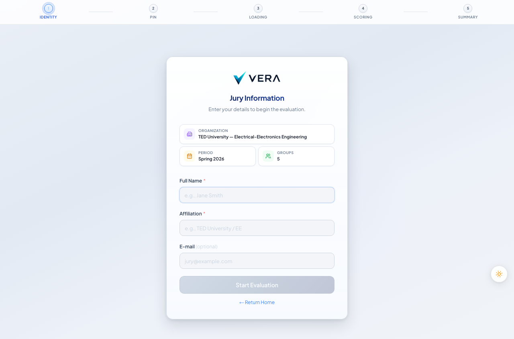
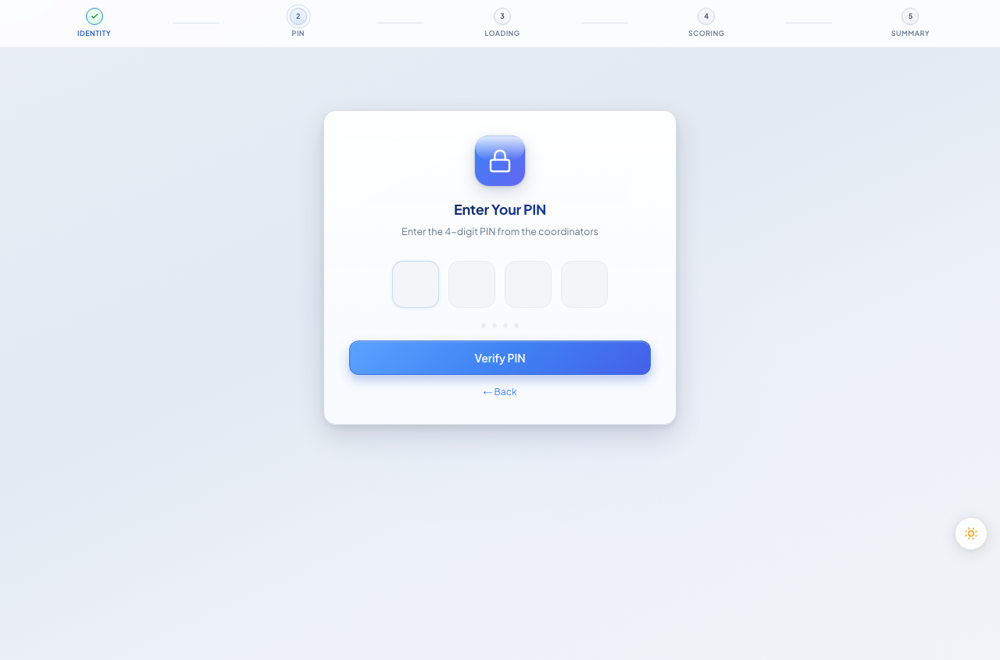
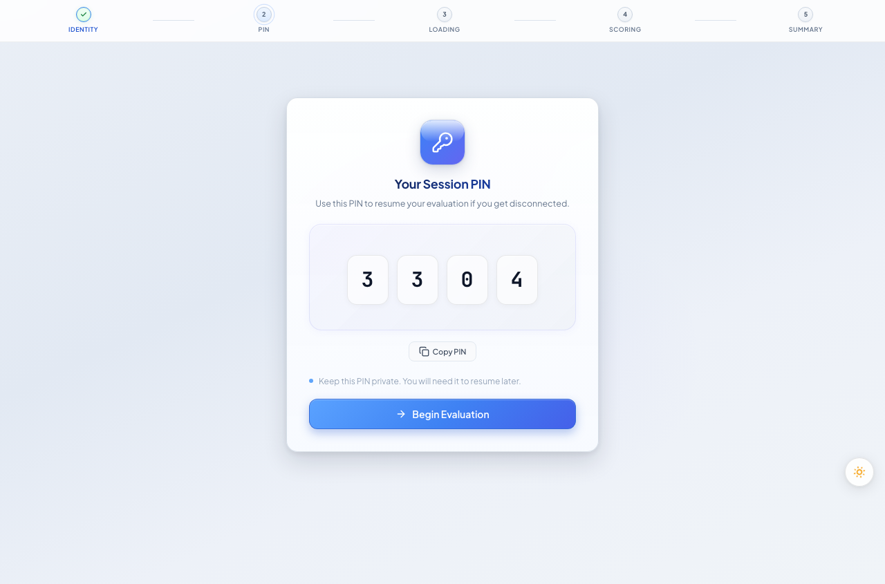
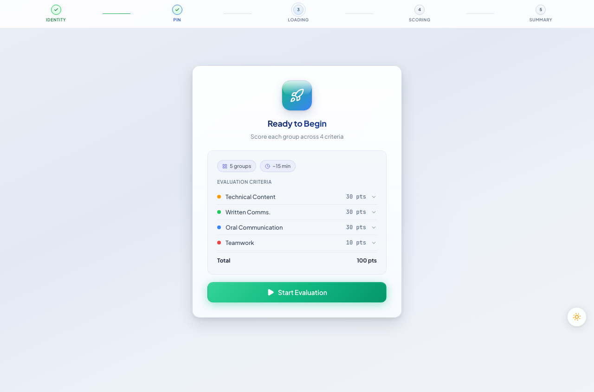
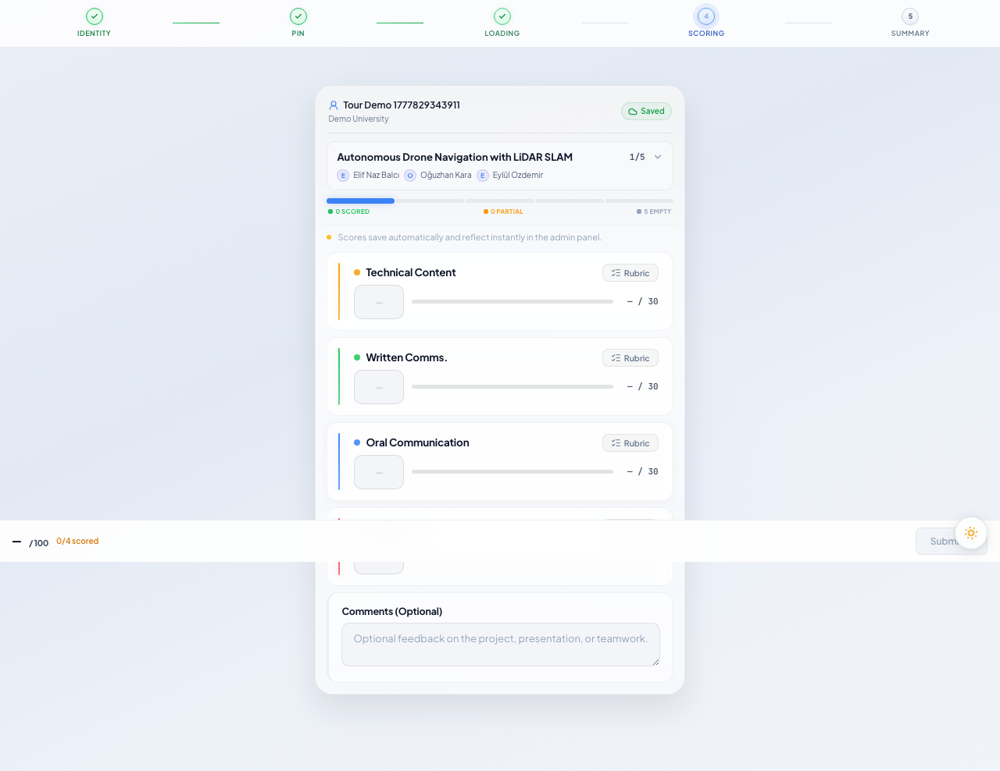
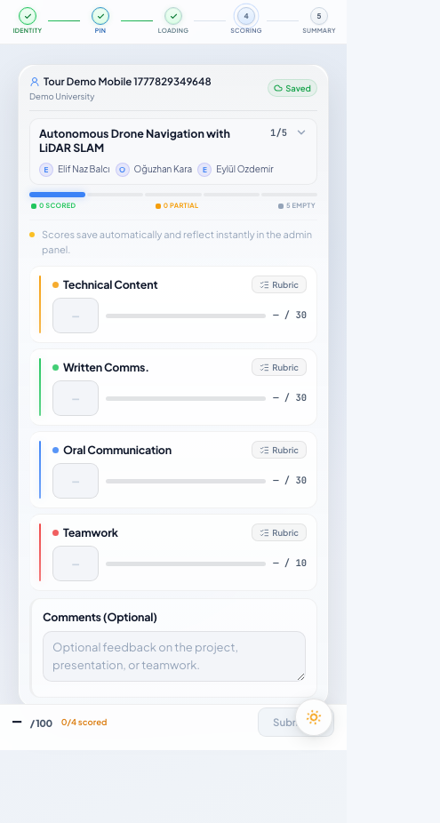
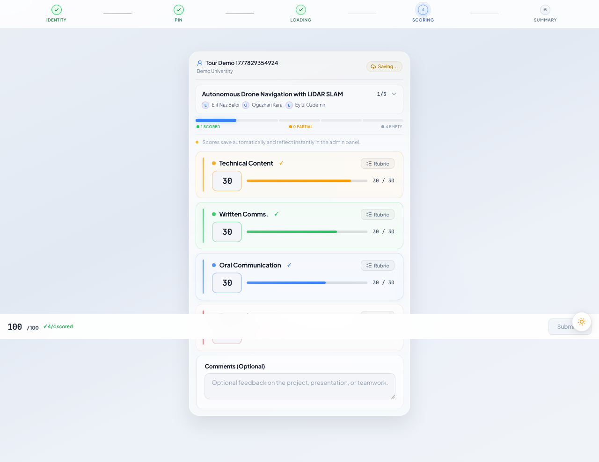
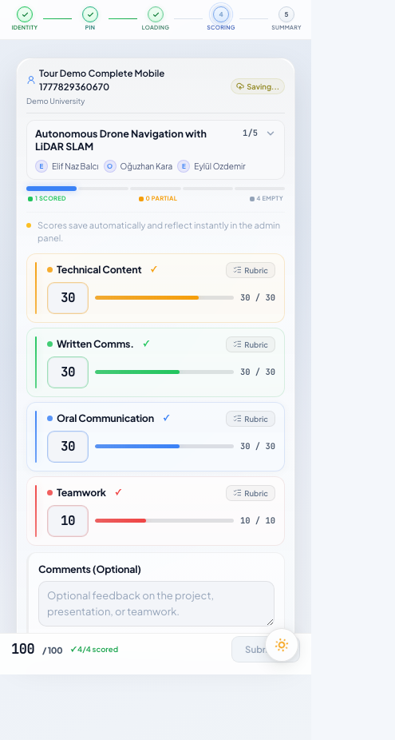

# Juror Walkthrough

The complete juror experience from entry token to final score submission. Jurors need no prior account, no institutional email, and no app install — just the entry link provided by the admin.

Steps 6 and 7 include both desktop and mobile-portrait screenshots to show that the full evaluation flow works on any device.

---

## 1. Arrival

**What this screen shows.** The arrival screen is the first thing a juror sees after following their entry link. It confirms that the token is valid and shows the name of the evaluation period they are about to enter. No login, no password, no friction.

**What to notice:**

- The entry token in the URL auto-fills the gate — jurors do not type anything on this screen.
- Invalid or expired tokens are rejected here with a clear message, not a generic 404.
- The screen is locale-aware; the period name and institution are drawn from the demo's live data.

---

## 2. Identity

**What this screen shows.** The only information VERA asks of a juror is their name and institutional affiliation. This data is used to label their scores in the admin views and printed on any exported reports. The form is intentionally minimal — most jurors complete it in under 30 seconds.

**What to notice:**

- Name and affiliation are free-text fields; no institutional directory lookup is required.
- Returning jurors who re-enter with the same name are matched to their existing session (scores are preserved, not duplicated).
- Field validation requires both fields to be filled before the form can be submitted.

---

## 3. PIN Entry

**What this screen shows.** Returning jurors — those who have previously completed the identity step and received a PIN — are directed to the PIN entry screen on re-entry. Entering the correct PIN restores their session exactly where they left off.

**What to notice:**

- PINs are short numeric codes displayed to the juror on their first entry (see screen 4).
- Three consecutive incorrect PIN attempts lock the entry; an admin must unlock the juror from the Jurors page.
- The PIN is the juror's persistent credential for the duration of the evaluation period — they are encouraged to keep it handy on jury day.

---

## 4. PIN Reveal

**What this screen shows.** First-time jurors are shown their PIN immediately after identity verification. This is the only time the full PIN is displayed. The juror is prompted to note it down before proceeding to the project list.

**What to notice:**

- The PIN is generated server-side and associated with the juror's identity record.
- The reveal screen includes a clear "I have noted my PIN" confirmation before proceeding — accidental dismissal does not lose the PIN because the admin can look it up in the Jurors page.
- The PIN persists across the full evaluation period; jurors who return the next day use the same PIN.

---

## 5. Progress

**What this screen shows.** The progress screen is the juror's home base during an evaluation session. It lists every project assigned to them and shows a completion indicator for each — not started, in progress, or submitted. Jurors navigate from here to each individual project's scoring sheet.

**What to notice:**

- The project list is ordered by the admin-configured sequence (typically alphabetical by project title).
- Partially completed projects are visually distinguished so jurors can quickly find where they left off.
- A final "Submit All" action becomes available only when every assigned project has been scored.

---

## 6. Evaluate

**Desktop:**

**Mobile portrait (390 × 844):**

**What this screen shows.** The evaluation form is one screen per project. Each row is one rubric criterion; the juror selects a score band and the corresponding numeric value is recorded. A running total updates as criteria are filled in. The form autosaves on every field blur so partial work is never lost.

**What to notice:**

- Criteria are displayed in the same order as configured by the admin; weights are shown so jurors understand relative importance.
- The mobile layout stacks criteria vertically with full-width touch targets — a juror scoring on a phone during a live presentation has no usability compromise.
- An unsaved-changes indicator appears if the juror navigates away mid-form; returning to the project restores the last saved state.

---

## 7. Complete

**Desktop:**

**Mobile portrait (390 × 844):**

**What this screen shows.** Once all criteria have been scored for a project, the Submit button becomes active. Submitting locks that project's scores — the juror can no longer edit them unless an admin explicitly opens an edit window. After all projects are submitted, the juror's session is marked complete and they are thanked for their participation.

**What to notice:**

- The submit button remains disabled until every criterion has a value — partial submissions are not possible.
- Score lock is enforced server-side; a submitted score cannot be altered by refreshing the page or replaying the API request.
- The mobile submit interaction is a full-width button with a 44 px tap target — intentionally easy to tap at the end of a long evaluation session.

---

*Screenshots captured automatically from the VERA demo environment (TEDU-EE, Spring 2026) using Playwright. Desktop viewport: 1280 × 720. Mobile portrait viewport: 390 × 844 (iPhone 12/13/14). Run `npm run screenshots` to regenerate.*
